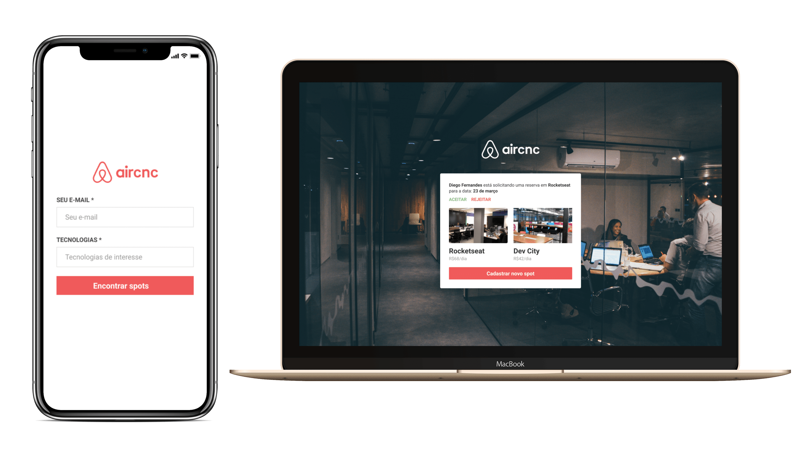

O Aircnc é um projeto que visa conectar empresas que querem abrir spots e desenvolvedores que procuram um lugar para trocar ideias com devs, conhecer a empresa e trabalhar lá por um período.

<h2>Tecnologias</h2>
<ul>
    <li>React.js</li>
    <li>Socket.io-Client</li>
</ul>

<h3>Projeto completo apresentado no inicio da semana para ser desenvolvido</h3>
<h4><strong>Obs:</strong>Sem o mobile</h4>

<h4>Login</h4>

<h5>Reserva:</h5>

